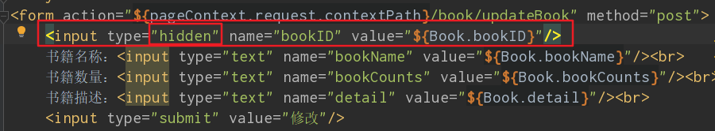

[TOC]

# 简单的整合SSM

## 1、数据库

```mysql
CREATE DATABASE ssmbuild;
USE ssmbuild
DROP TABLE IF EXISTS books;
CREATE TABLE books(
	bookID INT(10) NOT NULL AUTO_INCREMENT COMMENT '书id',
    bookName VARCHAR(100) NOT NULL COMMENT '书名',
    bookCounts INT(11) NOT NULL COMMENT '数量',
    detail VARCHAR(200) NOT NULL COMMENT '描述',
    KEY bookID (bookID)
)ENGINE=INNODB DEFAULT CHARSET=utf8

INSERT INTO books(bookID,bookName,bookCounts,detail)VALUES
(1,'Java',1,'从入门到精通'),
(2,'MySQL',10,'从删库到复原'),
(3,'Linux',5,'从入门到走向人生巅峰');
```

## 2、搭建项目（Mybatis层）

### 2.1、创建一个Maven项目

- 建立一个简单的maven项目，名称自定义，此项目取名ssmbuild

### 2.2、导入依赖

- 文件：项目根目录下的pom.xml

- 依赖

  - junit
  - 数据库驱动
  - 连接池
  - servlet
  - jsp
  - mybatis
  - mybatis-spring
  - spring

- 依赖名称及其版本

  ```xml
  <dependencies>
      <dependency>
          <groupId>junit</groupId>
          <artifactId>junit</artifactId>
          <version>4.11</version>
      </dependency>
      <dependency>
          <groupId>mysql</groupId>
          <artifactId>mysql-connector-java</artifactId>
          <version>5.1.47</version>
      </dependency>
      <!--数据库连接池：c3p0-->
      <dependency>
          <groupId>com.mchange</groupId>
          <artifactId>c3p0</artifactId>
          <version>0.9.5.2</version>
      </dependency>
      <!--servlet jsp-->
      <dependency>
          <groupId>javax.servlet</groupId>
          <artifactId>servlet-api</artifactId>
          <version>2.5</version>
      </dependency>
      <dependency>
          <groupId>javax.servlet.jsp</groupId>
          <artifactId>jsp-api</artifactId>
          <version>2.2</version>
      </dependency>
       <dependency>
          <groupId>javax.servlet</groupId>
          <artifactId>jstl</artifactId>
          <version>1.2</version>
      </dependency>
      <!--Mybatis-->
      <dependency>
          <groupId>org.mybatis</groupId>
          <artifactId>mybatis</artifactId>
          <version>3.5.2</version>
      </dependency>
      <dependency>
          <groupId>org.mybatis</groupId>
          <artifactId>mybatis-spring</artifactId>
          <version>2.0.2</version>
      </dependency>
      <!--Spring-->
      <dependency>
          <groupId>org.springframework</groupId>
          <artifactId>spring-jdbc</artifactId>
          <version>5.1.9.RELEASE</version>
      </dependency>
      <dependency>
          <groupId>org.springframework</groupId>
          <artifactId>spring-webmvc</artifactId>
          <version>5.1.9.RELEASE</version>
      </dependency>
  	<!--lombok-->
      <dependency>
              <groupId>org.projectlombok</groupId>
              <artifactId>lombok</artifactId>
              <version>1.16.10</version>
          </dependency>
  </dependencies>
  ```

  

### 2.3、静态资源导出问题

- 防止项目无法找到某些配置文件，添加资源配置路径

  ```xml
  <!--在build中配置resources，防止资源导出失败问题-->
  <!--父工程与子工程的pom.xml文件中均配置build-->
  <build>
      <resources>
          <resource>
              <directory>src/main/java</directory>
              <includes>
                  <include>**/*.properties</include>
                  <include>**/*.xml</include>
              </includes>
              <filtering>true</filtering>
          </resource>
      </resources>
  </build>
  ```

### 2.4、建立基本结构与配置框架

- package

  - com.lfc.pojo
  - com.lfc.dao
  - com.lfc.service
  - com.lfc.controller

- resources/mybatis-config.xml

  ```xml
  <?xml version="1.0" encoding="UTF-8" ?>
  <!DOCTYPE configuration
          PUBLIC "-//mybatis.org//DTD Config 3.0//EN"
          "http://mybatis.org/dtd/mybatis-3-config.dtd">
  <configuration>
      <!--配置数据源，交给spring去做-->
      
     <!-- 自动取别名-->
      <typeAliases>
          <package name="com.lfc.pojo"/>
      </typeAliases>
  </configuration>
  ```

- Spring配置文件：resources/applicationContext.xml

  ```xml
  <?xml version="1.0" encoding="UTF-8"?>
  <beans xmlns="http://www.springframework.org/schema/beans"
         xmlns:xsi="http://www.w3.org/2001/XMLSchema-instance"
         xsi:schemaLocation="http://www.springframework.org/schema/beans
          https://www.springframework.org/schema/beans/spring-beans.xsd">
  
  </beans>
  ```

### 2.5、连接数据库

- 数据库配置文件database.properties

  ```properties
  jdbc.driver=com.mysql.jdbc.Driver
  # Mysql 8.0+，需要在URL后添加时区，否则报错 + &serverTimezone=Asia/shanghai
  jdbc.url=jdbc:mysql://localhost:3306/ssmbuild?useSSL=false&useUnicode=true&characterEncoding=utf8
  jdbc.username=root
  jdc.password=123456
  ```

### 2.6、编写相应的类

- 实体类

  ```java
  package com.lfc.pojo;
  public class Books {
      private int bookID;
      private String bookName;
      private int bookCounts;
      private String detail;
  
      public Books() {
      }
  
      public Books(int bookID, String bookName, int bookCounts, String detail) {
          this.bookID = bookID;
          this.bookName = bookName;
          this.bookCounts = bookCounts;
          this.detail = detail;
      }
  
      public int getBookID() {
          return bookID;
      }
  
      public void setBookID(int bookID) {
          this.bookID = bookID;
      }
  
      public String getBookName() {
          return bookName;
      }
  
      public void setBookName(String bookName) {
          this.bookName = bookName;
      }
  
      public int getBookCounts() {
          return bookCounts;
      }
  
      public void setBookCounts(int bookCounts) {
          this.bookCounts = bookCounts;
      }
  
      public String getDetail() {
          return detail;
      }
  
      public void setDetail(String detail) {
          this.detail = detail;
      }
  
      @Override
      public String toString() {
          return "Books{" +
                  "bookID=" + bookID +
                  ", bookName='" + bookName + '\'' +
                  ", bookCounts=" + bookCounts +
                  ", detail='" + detail + '\'' +
                  '}';
      }
  }
  
  ```

- 接口

  ```java
  //com.lfc.dao.BookMapper
  public interface BookMapper {
      //增加一本书
      int addBook(Books books);
      //删除一本书
      int deleteBookById(int id);
      //更新一本书
      int updateBook(Books books);
      //查询一本书
      Books queryBookById(int id);
      //查询全部的书
      List<Books> queryAllBook();
  }
  ```

- 接口配置文件——com.lfc.dao/BookMapper.xml

  ```xml
  <?xml version="1.0" encoding="UTF-8" ?>
  <!DOCTYPE mapper
          PUBLIC "-//mybatis.org//DTD Config 3.0//EN"
          "http://mybatis.org/dtd/mybatis-3-mapper.dtd">
  <mapper namespace="com.lfc.dao.BookMapper">
      <insert id="addBook" parameterType="Books">
          insert into ssmbuild.books(bookName,bookCounts,detail)
          values(#{bookName},#{bookCounts},#{detail});
      </insert>
  
      <delete id="deleteBookById" parameterType="int">
          delete from ssmbuild.books where bookID=#{bookID};
      </delete>
  
      <update id="updateBook" parameterType="Books">
          update ssmbuild.books
          set bookName=#{bookName},bookCounts=#{bookCounts},detail=#{detail}
          where bookID=#{bookID};
      </update>
  
      <select id="queryBookById" resultType="Books">
          select * from ssmbuild.books where bookID=#{bookID};
      </select>
  
      <select id="queryAllBook" resultType="Books">
          select * from ssmbuild.books;
      </select>
  </mapper>
  ```

- 接口配置文件绑定到Mybatis

  - resources/mybatis-config.xml

  ```xml
  <?xml version="1.0" encoding="UTF-8" ?>
  <!DOCTYPE configuration
          PUBLIC "-//mybatis.org//DTD Config 3.0//EN"
          "http://mybatis.org/dtd/mybatis-3-config.dtd">
  <configuration>
      <!--配置数据源，交给spring去做-->
  
      <!-- 自动取别名-->
      <typeAliases>
          <package name="com.lfc.pojo"/>
      </typeAliases>
  
      <!--接口配置文件绑定-->
      <mappers>
          <mapper class="com.lfc.dao.BookMapper"/>
      </mappers>
  </configuration>
  ```

- 业务层

  ```java
  //com.lfc.service.BookService
  public interface BookService {
      //增加一本书
      int addBook(Books books);
      //删除一本书
      int deleteBookById(int id);
      //更新一本书
      int updateBook(Books books);
      //查询一本书
      Books queryBookById(int id);
      //查询全部的书
      List<Books> queryAllBook();
  }
  ```

  ```java
  //com.lfc.service.BookServiceImpl
  public class BookServiceImpl implements BookService {
  
      private BookMapper bookMapper;
  
      public void setBookMapper(BookMapper bookMapper) {
          this.bookMapper = bookMapper;
      }
  
      public int addBook(Books books) {
          return bookMapper.addBook(books);
      }
  
      public int deleteBookById(int id) {
          return bookMapper.deleteBookById(id);
      }
  
      public int updateBook(Books books) {
          return bookMapper.updateBook(books);
      }
  
      public Books queryBookById(int id) {
          return bookMapper.queryBookById(id);
      }
  
      public List<Books> queryAllBook() {
          return bookMapper.queryAllBook();
      }
  }
  ```

## 3、Spring层

### 3.1、整合DAO层

- Spring整合DAO层配置文件

  - /resources/spring-dao.xml

  ```xml
  <?xml version="1.0" encoding="UTF-8"?>
  <beans xmlns="http://www.springframework.org/schema/beans"
         xmlns:xsi="http://www.w3.org/2001/XMLSchema-instance"
         xmlns:context="http://www.springframework.org/schema/context"
         xsi:schemaLocation="http://www.springframework.org/schema/beans
          https://www.springframework.org/schema/beans/spring-beans.xsd
          http://www.springframework.org/schema/context
          https://www.springframework.org/schema/context/spring-context.xsd">
      <!--1、关联数据库配置文件-->
      <context:property-placeholder location="classpath:database.properties"/>
  
      <!--2、连接池-->
      <bean id="dataSource" class="com.mchange.v2.c3p0.ComboPooledDataSource">
          <property name="driverClass" value="${jdbc.driver}"/>
          <property name="jdbcUrl" value="${jdbc.url}"/>
          <property name="user" value="${jdbc.username}"/>
          <property name="password" value="${jdc.password}"/>
          <!-- c3p0连接池私有属性-->
          <property name="maxPoolSize" value="30"/>
          <property name="minPoolSize" value="10"/>
          <!--关闭连接后不自动提交-->
          <property name="autoCommitOnClose" value="false"/>
          <!--获取连接超时时间-->
          <property name="checkoutTimeout" value="10000"/>
          <!--获取连接失败重试次数-->
          <property name="acquireRetryAttempts" value="2"/>
      </bean>
  
      <!--3、sqlSessionFactory-->
      <bean id="sqlSessionFactory" class="org.mybatis.spring.SqlSessionFactoryBean">
          <property name="dataSource" ref="dataSource"/>
          <!--绑定Mybatis配置文件-->
          <property name="configLocation" value="classpath:mybatis-config.xml"/>
      </bean>
  
      <!--4、配置dao接口扫描包，动态实现Dao接口注入到Spring容器-->
      <bean class="org.mybatis.spring.mapper.MapperScannerConfigurer">
          <property name="sqlSessionFactoryBeanName" value="sqlSessionFactory"/>
          <property name="basePackage" value="com.lfc.dao"/>
      </bean>
  </beans>
  ```

### 3.2、Spring绑定service

- /resources/spring-service.xml

  ```xml
  <?xml version="1.0" encoding="UTF-8"?>
  <beans xmlns="http://www.springframework.org/schema/beans"
         xmlns:xsi="http://www.w3.org/2001/XMLSchema-instance"
         xmlns:context="http://www.springframework.org/schema/context"
         xsi:schemaLocation="http://www.springframework.org/schema/beans
         https://www.springframework.org/schema/beans/spring-beans.xsd
         http://www.springframework.org/schema/context
         https://www.springframework.org/schema/context/spring-context.xsd">
  
      <!-- 1、扫描service下的包-->
      <context:component-scan base-package="com.lfc.service"/>
  
      <!-- 2、将所有业务类注入到Spring,可通过配置或注解实现  -->
      <bean id="BookServiceImpl" class="com.lfc.service.BookServiceImpl">
          <property name="bookMapper" ref="bookMapper"/>
      </bean>
  
      <!--3、配置声明式事务-->
      <bean id="transactionManager" class="org.springframework.jdbc.datasource.DataSourceTransactionManager">
          <property name="dataSource" ref="dataSource"/>
      </bean>
  
      <!-- 4、AOP事务支持-->
  </beans>
  ```

### 3.3、Spring整合配置文件

- resources/applicationContext.xml

  ```xml
  <?xml version="1.0" encoding="UTF-8"?>
  <beans xmlns="http://www.springframework.org/schema/beans"
         xmlns:xsi="http://www.w3.org/2001/XMLSchema-instance"
         xsi:schemaLocation="http://www.springframework.org/schema/beans
          https://www.springframework.org/schema/beans/spring-beans.xsd">
  
      <import resource="classpath:spring-dao.xml"/>
      <import resource="classpath:spring-service.xml"/>
  
  </beans>
  ```

  

## 4、SpringMVC层

### 4.1、为项目添加web支持

- 右键项目名称 -> Add Frameworks Support -> 勾选Web Application(4.0) ->  OK

  

### 4.2、配置文件

- /web/WEB-INF/web.xml

  ```xml
  <?xml version="1.0" encoding="UTF-8"?>
  <web-app xmlns="http://xmlns.jcp.org/xml/ns/javaee"
           xmlns:xsi="http://www.w3.org/2001/XMLSchema-instance"
           xsi:schemaLocation="http://xmlns.jcp.org/xml/ns/javaee
           http://xmlns.jcp.org/xml/ns/javaee/web-app_4_0.xsd"
           version="4.0">
  
      <!--DispatchServlet-->
      <servlet>
          <servlet-name>springmvc</servlet-name>
          <servlet-class>org.springframework.web.servlet.DispatcherServlet</servlet-class>
          <init-param>
              <param-name>contextConfigLocation</param-name>
              <param-value>classpath:applicationContext.xml</param-value>
          </init-param>
          <load-on-startup>1</load-on-startup>
      </servlet>
      <servlet-mapping>
          <servlet-name>springmvc</servlet-name>
          <url-pattern>/</url-pattern>
      </servlet-mapping>
  
      <!-- 乱码过滤-->
      <filter>
          <filter-name>encodingFilter</filter-name>
          <filter-class>org.springframework.web.filter.CharacterEncodingFilter</filter-class>
          <init-param>
              <param-name>encoding</param-name>
              <param-value>utf-8</param-value>
          </init-param>
      </filter>
      <filter-mapping>
          <filter-name>encodingFilter</filter-name>
          <url-pattern>/* </url-pattern>
      </filter-mapping>
  
      <!--Session-->
      <session-config>
          <session-timeout>15</session-timeout>
      </session-config>
  </web-app>
  ```

### 4.3、mvc配置文件

- /resources/spring-mvc.xml

  ```xml
  <?xml version="1.0" encoding="UTF-8"?>
  <beans xmlns="http://www.springframework.org/schema/beans"
         xmlns:xsi="http://www.w3.org/2001/XMLSchema-instance"
          xmlns:mvc="http://www.springframework.org/schema/mvc"
         xmlns:context="http://www.springframework.org/schema/context"
         xsi:schemaLocation="http://www.springframework.org/schema/beans
          https://www.springframework.org/schema/beans/spring-beans.xsd
          http://www.springframework.org/schema/context
          http://www.springframework.org/schema/context/spring-context.xsd
          http://www.springframework.org/schema/mvc
          http://www.springframework.org/schema/mvc/spring-mvc.xsd">
      <!--1、注解驱动-->
      <mvc:annotation-driven/>
      <!--2、静态资源过滤-->
      <mvc:default-servlet-handler/>
      <!--3、 扫描包：controller-->
      <context:component-scan base-package="com.lfc.controller"/>
      <!--4、 视图解析器-->
      <bean class="org.springframework.web.servlet.view.InternalResourceViewResolver">
          <property name="prefix" value="/WEB-INF/jsp/"/>
          <property name="suffix" value=".jsp"/>
      </bean>
  </beans>
  ```

- resources/applicationContext.xml

  ```xml
  <?xml version="1.0" encoding="UTF-8"?>
  <beans xmlns="http://www.springframework.org/schema/beans"
         xmlns:xsi="http://www.w3.org/2001/XMLSchema-instance"
         xsi:schemaLocation="http://www.springframework.org/schema/beans
          https://www.springframework.org/schema/beans/spring-beans.xsd">
  
      <import resource="classpath:spring-dao.xml"/>
      <import resource="classpath:spring-service.xml"/>
      <import resource="classpath:spring-mvc.xml"/>
  </beans>
  ```

## 5、增删改查

### 5.1、conroller层

```java
//com.lfc.controller.BookController;
@Controller
@RequestMapping("/book")
public class BookController {

    //controller 调service层
    @Autowired
    @Qualifier("BookServiceImpl")
    private BookService bookService;

    //查询全部书籍。并返回书籍展示界面
    @RequestMapping("/allBook")
    public String list(Model model){
        List<Books> list=bookService.queryAllBook();
        model.addAttribute("list",list);
        return "allBook";
    }

    //跳转到增加书籍页面
    @RequestMapping("/toAddBook")
    public String toAddPaper(){
        return "addBook";
    }

    //添加书籍请求
    @RequestMapping("/addBook")
    public String addBook(Books books){
        System.out.println("books:"+books);
        bookService.addBook(books);
        return "redirect:/book/allBook";
    }

    //跳转到修改界面
    @RequestMapping("/toUpdateBook")
    public String toUpdatePaper(int id,Model model){
        Books book =bookService.queryBookById(id);
        model.addAttribute("Book",book);
        return "updateBook";
    }

    //提交修改数据请求
    @RequestMapping("/updateBook")
    public String updateBook(Books books){
//        System.out.println("books:"+books);
        bookService.updateBook(books);
        return "redirect:/book/allBook";
    }

    //删除书籍
    @RequestMapping("/deleteBook")
    public String deleteBook(int id){
        bookService.deleteBookById(id);
        return "redirect:/book/allBook";
    }
}

```

### 5.2、JSP层

- web/index.jsp

  ```jsp
  <%@ page contentType="text/html;charset=UTF-8" language="java" %>
  <html>
      <head>
          <title>$Title$</title>
      </head>
      <body>
          <h3>
              <a href="${pageContext.request.contextPath}/book/allBook">进入书籍页面</a>
          </h3>
          <h3>
              <a href="${pageContext.request.contextPath}/book/toAddBook">添加书籍页面</a>
          </h3>
      </body>
  </html>
  ```

  

- web/WEB-INF/jsp/addBook.jsp

  ```jsp
  <%@ page contentType="text/html;charset=UTF-8" language="java" %>
  <html>
      <head>
          <title>addBook</title>
      </head>
      <body>
          <h4>添加书籍</h4>
          <form action="${pageContext.request.contextPath}/book/addBook" method="post">
              书籍名称：<input type="text" name="bookName"/><br>
              书籍数量：<input type="text" name="bookCounts"/><br>
              书籍描述：<input type="text" name="detail"/><br>
              <input type="submit" value="添加"/>
          </form>
      </body>
  </html>
  ```

  

- web/WEB-INF/jsp/allBook.jsp

  ```jsp
  <%@ taglib prefix="c" uri="http://java.sun.com/jsp/jstl/core" %>
  <%@ page contentType="text/html;charset=UTF-8" language="java" %>
  <html>
      <head>
          <title>allBook</title>
      </head>
      <body>
          <h3>书籍列表</h3>
          <hr>
          <table>
              <tr>
                  <th>书籍编号</th>
                  <th>书籍名称</th>
                  <th>书籍数量</th>
                  <th>书籍描述</th>
              </tr>
              <c:forEach var="book" items="${list}">
                  <tr>
                      <td>${book.bookID}</td>
                      <td>${book.bookName}</td>
                      <td>${book.bookCounts}</td>
                      <td>${book.detail}</td>
                      <td>
                          <a href="${pageContext.request.contextPath}/book/toUpdateBook?id=${book.bookID}">修改</a>
                          &nbsp; | &nbsp;
                          <a href="${pageContext.request.contextPath}/book/deleteBook?id=${book.bookID}">删除</a>
                      </td>
                  </tr>
              </c:forEach>
          </table>
      </body>
  </html>
  ```

  

- web/WEB-INF/jsp/updateBook.jsp

  ```jsp
  <%@ page contentType="text/html;charset=UTF-8" language="java" %>
  <html>
      <head>
          <title>updateBook</title>
      </head>
      <body>
          <form action="${pageContext.request.contextPath}/book/updateBook" method="post">
              书籍名称：<input type="text" name="bookName" value="${Book.bookName}"/><br>
              书籍数量：<input type="text" name="bookCounts" value="${Book.bookCounts}"/><br>
              书籍描述：<input type="text" name="detail" value="${Book.detail}"/><br>
              <input type="submit" value="修改"/>
          </form>
      </body>
  </html>
  ```

## 6、错误汇总

### 6.1、Mybatis数据库查询失败

- 错误信息

  ```txt
  主要错误信息提取：
  Cause: org.apache.ibatis.executor.ExecutorException: A query was run and no Result Maps were found
  
  Exception in thread "main" org.mybatis.spring.MyBatisSystemException: nested exception is org.apache.ibatis.executor.ExecutorException: A query was run and no Result Maps were found for the Mapped Statement 'com.lfc.dao.BookMapper.queryBookById'.  It's likely that neither a Result Type nor a Result Map was specified.
  	at org.mybatis.spring.MyBatisExceptionTranslator.translateExceptionIfPossible(MyBatisExceptionTranslator.java:78)
  	at org.mybatis.spring.SqlSessionTemplate$SqlSessionInterceptor.invoke(SqlSessionTemplate.java:440)
  	at com.sun.proxy.$Proxy14.selectOne(Unknown Source)
  	at org.mybatis.spring.SqlSessionTemplate.selectOne(SqlSessionTemplate.java:159)
  	at org.apache.ibatis.binding.MapperMethod.execute(MapperMethod.java:87)
  	at org.apache.ibatis.binding.MapperProxy.invoke(MapperProxy.java:57)
  	at com.sun.proxy.$Proxy15.queryBookById(Unknown Source)
  	at com.lfc.service.BookServiceImpl.queryBookById(BookServiceImpl.java:29)
  	at MyTest.main(MyTest.java:15)
  Caused by: org.apache.ibatis.executor.ExecutorException: A query was run and no Result Maps were found for the Mapped Statement 'com.lfc.dao.BookMapper.queryBookById'.  It's likely that neither a Result Type nor a Result Map was specified.
  	at org.apache.ibatis.executor.resultset.DefaultResultSetHandler.validateResultMapsCount(DefaultResultSetHandler.java:289)
  	at org.apache.ibatis.executor.resultset.DefaultResultSetHandler.handleResultSets(DefaultResultSetHandler.java:191)
  	at org.apache.ibatis.executor.statement.PreparedStatementHandler.query(PreparedStatementHandler.java:65)
  	at org.apache.ibatis.executor.statement.RoutingStatementHandler.query(RoutingStatementHandler.java:79)
  	at org.apache.ibatis.executor.SimpleExecutor.doQuery(SimpleExecutor.java:63)
  	at org.apache.ibatis.executor.BaseExecutor.queryFromDatabase(BaseExecutor.java:324)
  	at org.apache.ibatis.executor.BaseExecutor.query(BaseExecutor.java:156)
  	at org.apache.ibatis.executor.CachingExecutor.query(CachingExecutor.java:109)
  	at org.apache.ibatis.executor.CachingExecutor.query(CachingExecutor.java:83)
  	at org.apache.ibatis.session.defaults.DefaultSqlSession.selectList(DefaultSqlSession.java:147)
  	at org.apache.ibatis.session.defaults.DefaultSqlSession.selectList(DefaultSqlSession.java:140)
  	at org.apache.ibatis.session.defaults.DefaultSqlSession.selectOne(DefaultSqlSession.java:76)
  	at sun.reflect.NativeMethodAccessorImpl.invoke0(Native Method)
  	at sun.reflect.NativeMethodAccessorImpl.invoke(NativeMethodAccessorImpl.java:62)
  	at sun.reflect.DelegatingMethodAccessorImpl.invoke(DelegatingMethodAccessorImpl.java:43)
  	at java.lang.reflect.Method.invoke(Method.java:498)
  	at org.mybatis.spring.SqlSessionTemplate$SqlSessionInterceptor.invoke(SqlSessionTemplate.java:426)
  	... 7 more
  ```

- 错误原因：没有设置返回值的结果类型

  

- 注意：Mybatis中，注意查询insert与增删改操作的配置有差别

  - insert、delete、update都需要指定参数类型parameterType=“xxx”
  - select则需要指定返回值类型resultType=“xxx”

- 改正：

### 6.2、SSM项目配置Tomcat故障

- web项目配置的Tomcat运行后没有生成  **out**  文件夹，导致网页文件都找不到

- 改正（重新配置Tomcat）：file  -> settings

- 第一步：Tomcat添加lib文件夹

  

- 第二步：添加Artifact

  

### 6.3、更新失败

- 错误点

  

- 错误分析：修改的书籍，没有将bookID提交，而修改方法需要根据bookID确定修改对象，故修改书籍信息失败

- 改正：